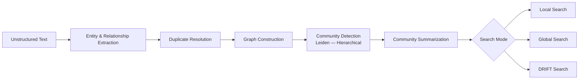

# Recon-GraphRAG

[](https://github.com/FadhelHaidar/Recon-GraphRAG/actions/workflows/ci.yml)
[](https://www.python.org/downloads/)
[](LICENSE)
[](https://github.com/FadhelHaidar/Recon-GraphRAG/releases)

Domain-agnostic GraphRAG SDK for Neo4j and Memgraph, with a pluggable graph-store backend and the [Microsoft GraphRAG](https://microsoft.github.io/graphrag/) philosophy.

> **Work in Progress** — This project is under active development and is not yet reliable for production use. APIs may change without notice, and features may be incomplete or unstable.

## Table of Contents

- [Key Features](#key-features)
- [Architecture](#architecture)
- [Requirements](#requirements)
- [Install](#install)
- [Quick Start](#quick-start)
- [Supported Providers](#supported-providers)
- [Documentation](#documentation)
- [Example](#example)
- [Acknowledgments](#acknowledgments)
- [Contributing](#contributing)
- [Changelog](#changelog)
- [License](#license)

## Key Features

- 🔌 **Pluggable graph backends** — Swap between Neo4j and Memgraph via the `GraphStore` protocol
- 🧠 **Hierarchical community detection** — Multi-level Leiden communities with LLM-generated summaries
- 🔍 **Three search paradigms** — Local, Global, and DRIFT search for different levels of specificity
- 📐 **Schema-driven extraction** — Define typed nodes, relationships, and patterns before building, or let `analyze_schema()` propose a schema from sample documents
- 🔗 **Hybrid entity resolution** — Fuzzy matching with LLM-based rescue for robust deduplication
- 🏗️ **Composable building blocks** — Use high-level pipelines or individual workflow steps
- 🤖 **Multiple LLM providers** — OpenAI, Anthropic, Ollama, OpenRouter, and any OpenAI-compatible endpoint
- 📊 **Citations with source metadata** — Every answer includes traceable source references

## Architecture

Recon-GraphRAG follows the two-stage approach popularized by [Microsoft GraphRAG](https://microsoft.github.io/graphrag/): first build a structured knowledge graph with hierarchical community summaries, then query it with retrieval-augmented generation.



## Requirements

- **Python** >= 3.11
- One supported graph database:
  - **Neo4j** with **APOC** for merge helpers and **GDS** for Leiden community detection
  - **Memgraph** with **MAGE** for Leiden community detection

See [docs/01-installation.md](docs/01-installation.md) for detailed setup instructions. The included Docker Compose file configures both databases.

### Backend requirements

The `GraphStore` protocol is designed to be backend-agnostic. A backend must support the following server-side capabilities to run the full Recon-GraphRAG pipeline:

- Vector indexes and approximate nearest-neighbor search
- Fulltext indexes
- Multi-level community detection (Leiden)
- Cypher-compatible query language
- Internal node identity-based embedding upsert
- Entity merge / deduplication

Neo4j and Memgraph implement the same `GraphStore` contract. Their index and community-detection implementations use each database's native capabilities.

## Install

The package is not yet on PyPI. Install it directly from GitHub with `uv`:

```bash
uv add git+https://github.com/FadhelHaidar/Recon-GraphRAG.git
uv sync
```

With optional extras:

```bash
uv add "recon-graphrag[all] @ git+https://github.com/FadhelHaidar/Recon-GraphRAG.git"
uv sync
```

`openai`, `sentence-transformers`, and the Neo4j driver are included in the core package, so the `[all]` extra only adds the Ollama client and any remaining optional providers.

Pin to a specific release:

```bash
uv add git+https://github.com/FadhelHaidar/Recon-GraphRAG.git@v0.4.0
uv sync
```

See [docs/01-installation.md](docs/01-installation.md) for more install options (`pip`, editable install, clone-without-install, extras, version pinning, troubleshooting).

## Quick Start

```python
from neo4j import GraphDatabase
from recon_graphrag import (
    LocalSearchRetriever,
    GraphBuilderPipeline,
    CommunityPipeline,
    Neo4jGraphStore,
    IndexConfig,
    create_llm,
    create_embedder,
    GraphSchema,
    NodeType,
    PropertyType,
    RelationshipType,
)

# Connect to Neo4j (see the quick start for the Memgraph alternative)
driver = GraphDatabase.driver("bolt://localhost:7688", auth=("neo4j", "password"))
store = Neo4jGraphStore(driver)

# Create indexes
store.create_indexes(IndexConfig(), embedding_dim=1536)

# Define a schema
schema = GraphSchema(
    node_types=[
        NodeType(
            label="Person",
            description="An individual such as an actor or director",
            properties=[
                PropertyType(name="occupation", type="STRING", description="Primary role or profession"),
            ],
        ),
        NodeType(
            label="Movie",
            description="A film or motion picture",
            properties=[
                PropertyType(name="release_year", type="STRING", description="Year the film was released"),
                PropertyType(name="genre", type="STRING", description="Primary genre"),
            ],
        ),
    ],
    relationship_types=[
        RelationshipType(label="DIRECTED", description="Person directed a movie"),
    ],
    patterns=[("Person", "DIRECTED", "Movie")],
)

# Create providers
llm = create_llm("openai", model_name="gpt-4o", api_key="sk-...")
embedder = create_embedder("openai", model="text-embedding-3-small", api_key="sk-...")

# Build the graph
pipeline = GraphBuilderPipeline(graph_store=store, llm=llm, embedder=embedder, schema=schema)
await pipeline.build_from_text("Christopher Nolan directed Inception...")

# Build communities
community = CommunityPipeline(
    graph_store=store,
    llm=llm,
    embedder=embedder,
    relationship_types=["DIRECTED"],
)
await community.build()

# Search
local_search = LocalSearchRetriever(store, llm, embedder)
result = await local_search.search("What are the key findings?", top_k=10)
print(result.answer)
for citation in result.citations:
    print(citation.metadata)  # arbitrary source metadata, e.g. record_id/table/page
```

For a step-by-step walkthrough, see [docs/02-quickstart.md](docs/02-quickstart.md).

## Supported Providers

| Provider | LLM | Embeddings | Notes |
|---|---|---|---|
| OpenAI | ✅ | ✅ | Default, recommended |
| Anthropic | ✅ | — | `uv add "recon-graphrag[anthropic] @ git+https://github.com/FadhelHaidar/Recon-GraphRAG.git"` |
| Ollama | ✅ | ✅ | `uv add "recon-graphrag[ollama] @ git+https://github.com/FadhelHaidar/Recon-GraphRAG.git"` |
| Sentence Transformers | — | ✅ | Local embeddings, no API key needed |
| OpenRouter | ✅ | — | Via OpenAI-compatible interface |

## Documentation

| Document | Description |
| --- | --- |
| [docs/installation.md](docs/01-installation.md) | Full installation guide, Docker setup, extras, and troubleshooting |
| [docs/quickstart.md](docs/02-quickstart.md) | Step-by-step quick start |
| [docs/schema.md](docs/03-schema.md) | Defining schemas with `GraphSchema` and `build_schema()`, or auto-analyzing one with `analyze_schema()` |
| [docs/indexing.md](docs/04-indexing.md) | Creating and managing Neo4j and Memgraph indexes |
| [docs/pipelines.md](docs/05-pipelines.md) | `GraphBuilderPipeline` and `CommunityPipeline` architecture |
| [docs/search.md](docs/06-search.md) | Local, global, and DRIFT search modes, citations, and source metadata |
| [docs/example.md](docs/07-example.md) | Movie industry example walkthrough |
| [docs/providers.md](docs/08-providers.md) | LLM and embedder providers |
| [docs/workflows.md](docs/09-workflows.md) | Composable building blocks below the high-level pipelines |
| [docs/testing.md](docs/10-testing.md) | Running tests and integration test flags |

## Example

A complete movie industry example is available in [examples/](examples/):

```bash
cd examples
python extract.py
python ingest.py --backend all --entity-resolution-strategy hybrid --llm-provider openrouter
python communities.py --backend all
python search.py --backend neo4j
python search.py --backend memgraph
```

See [docs/07-example.md](docs/07-example.md) for a full walkthrough.

### Sample Output

**Question:** *"What are the key relationships between directors and genres?"*

**Answer:** Based on the knowledge graph, Christopher Nolan has a strong association with the sci-fi and thriller genres through films like *Inception* (2010) and *Interstellar* (2014)...

**Citations:**
- `record_42` — entity: Christopher Nolan, confidence: 0.95
- `record_87` — relationship: DIRECTED → Inception

## Acknowledgments

This project is built on the knowledge graph retrieval methodology pioneered by [Microsoft GraphRAG](https://microsoft.github.io/graphrag/). It also relies on [Neo4j](https://neo4j.com/), [Memgraph](https://memgraph.com/), and the broader open source ecosystem for graph databases, LLMs, and embeddings.

## Contributing

Contributions are welcome! Please see [CONTRIBUTING.md](CONTRIBUTING.md) for development setup, branch naming, commit conventions, and the pull request process.

## Changelog

See [CHANGELOG.md](CHANGELOG.md) for release history.

## License

This project is licensed under the [MIT License](LICENSE).
